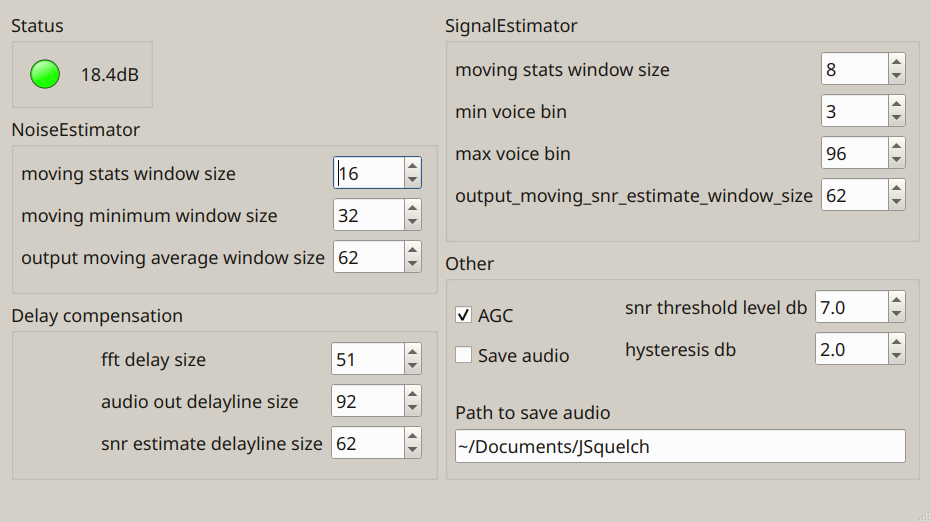

# JSquelch


This application detects voice and other non-continuous audio signals and records them to disk.



The idea was to be able to record HF SSB voice signals only when the voice was present. I have no idea how well it works yet for its purpose but it’s an interesting application.

Initially I was thinking I could use some sort of neural network to solve the problem but in the end I have used more traditional methods. For a writeup see https://jontio.zapto.org/hda1/jsquelch 

VoiceDetectionAlgo is the class that performs the voice detection. The following code snippet gives you an example of how to use it…

```C++
    VoiceDetectionAlgo algo;

    //load test file
    QFile file("test_signal_time.raw");
    file.open(QIODevice::ReadOnly);
    QDataStream datastream(&file);
    datastream.setByteOrder(QDataStream::LittleEndian);
    datastream.setFloatingPointPrecision (QDataStream::SinglePrecision);

    QVector<double> x;
    x.fill(0,128);

    //what we want from the algo output
    QVector<double> actual_snr_estimate_db_signal;
    QVector<double> actual_output_signal;

    //run algo over file
    while(!file.atEnd())
    {
        //read some audio
        for(int i=0;i<x.size();i++)
        {
            if(file.atEnd())break;
            datastream>>x[i];
        }
        if(file.atEnd())break;

        //send the audio to the algo
        algo<<x;

        //process the audio wile we have some
        while(!algo.process().empty())
        {
            //skip nan blocks
            if(isnan(algo.snr_db))continue;

            //keep snr_db
            actual_snr_estimate_db_signal+=algo.snr_db;

            //keep output signal when snr_db is good
            if(algo.snr_db<5.0) continue;
            actual_output_signal+=algo.ifft;
        }

    }
    file.close();

    file.setFileName("audio_out.raw");
    file.open(QIODevice::WriteOnly|QIODevice::Truncate));
    for(int k=0;k<actual_output_signal.size();k++)datastream<<actual_output_signal[k];
    file.close();
```

## Building

For Linux on Debianish distros follow the [ci.yml](.github/workflows/ci.yml) workflow file. The CI workflow automatically creates new releases for successful builds on `ubuntu-latest` GitHub VMs. See [here](releases/tag/latest) for latest successful `ubuntu-latest` build. For some reason libopusenc-dev is not available in ubuntu repos so the CI workflow also creates a deb package for libopusenc-dev too.

For Windows install MSYS2 then install this and that. You don't need to build anything apart from JSquelch as libopusenc is already in the repo that MSYS2 provides (type `pacman -S mingw-w64-x86_64-libopusenc` to install it). Use MinGW Qt flavor. Also for the qmake command I had to add `"INCLUDEPATH += C:/msys64/mingw64/include/opus"` as an option as that was the folder that libopusenc headers went in and that's not what Qt expected.

Jonti <br>
2021
